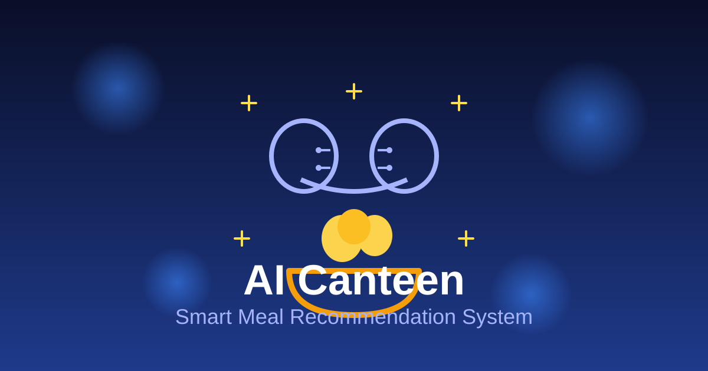
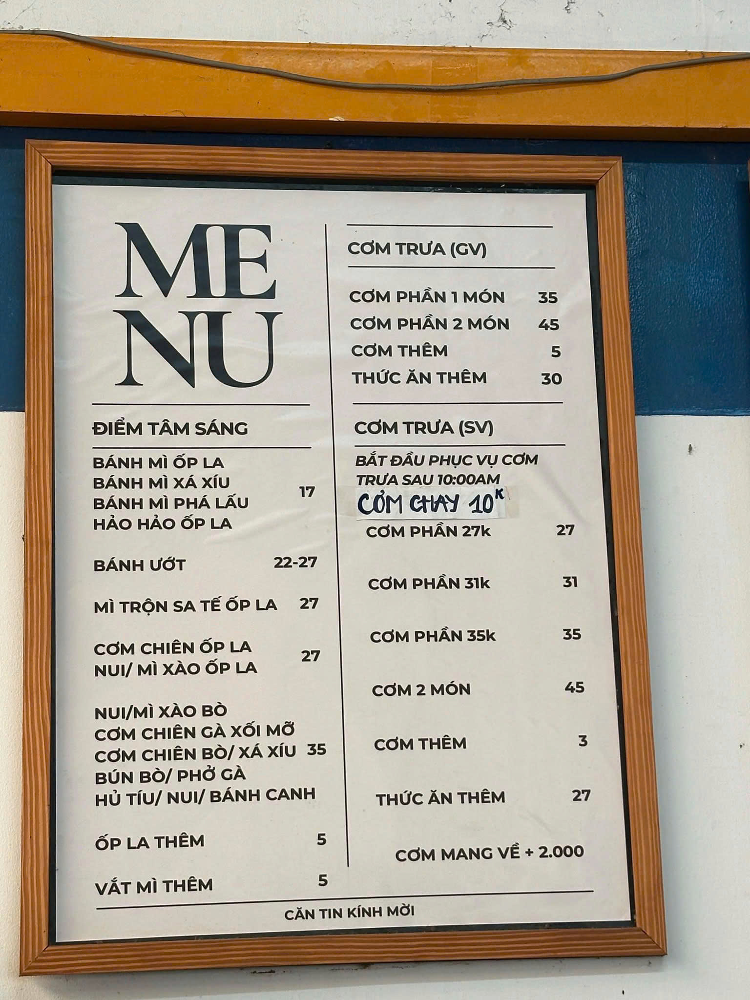
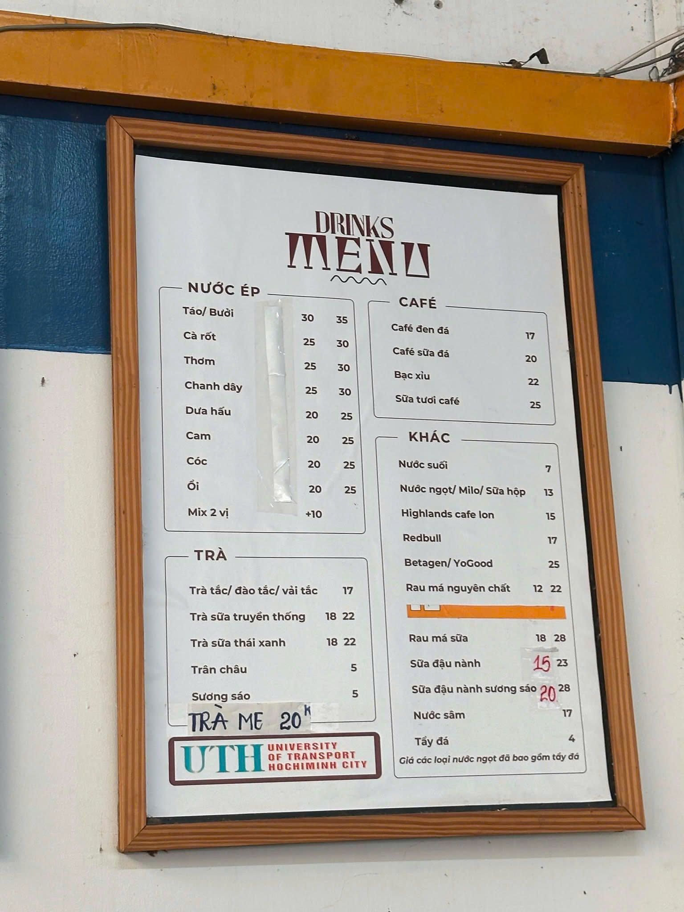

<div align="center">



# AI-Powered Canteen Recommendation System

A smart meal recommendation system for university canteens using AI techniques including Constraint Satisfaction Problems (CSP), Backtracking Search, and Heuristic Utility Evaluation.

</div>

## About

This system helps students find optimal meal combinations based on their preferences, dietary requirements, budget constraints, and nutritional needs. The application uses advanced AI algorithms to provide personalized recommendations while respecting all user constraints.

## Features

- Intelligent meal recommendation using CSP and backtracking search
- Multi-criteria optimization (nutrition, price, preferences)
- Support for various dietary restrictions (vegetarian, low-carb, allergies)
- Real-time constraint satisfaction checking
- Detailed explanation of AI decision-making process
- Vietnamese language interface
- Fully responsive design
- Visual menu gallery with real canteen photos

## Screenshots

<div align="center">


</div>

## Technologies

- Python 3.x
- Streamlit (Web UI)
- Custom CSP solver
- Backtracking search algorithm
- Heuristic utility evaluation engine

## Installation

1. Clone the repository:
```bash
git clone https://github.com/khainhq/responsive.git
cd responsive
```

2. Create a virtual environment:
```bash
python -m venv .venv
```

3. Activate the virtual environment:
- Windows: `.venv\Scripts\activate`
- Linux/Mac: `source .venv/bin/activate`

4. Install dependencies:
```bash
pip install -r requirements.txt
```

## Usage

Run the application:
```bash
streamlit run app.py
```

Or use the provided batch file (Windows):
```bash
run_project.bat
```

The application will open in your default web browser at `http://localhost:8501`

## Project Structure

- `app.py` - Main Streamlit web application
- `csp.py` - Constraint Satisfaction Problem model
- `backtracking_search.py` - Backtracking search algorithm implementation
- `inference_engine.py` - AI inference and reasoning engine
- `knowledge_base.py` - Meal and nutrition database
- `utility.py` - Utility function for multi-criteria evaluation
- `rule_engine.py` - Business rules and constraint validation
- `search_optimizer.py` - Search space optimization
- `test_system.py` - Comprehensive system testing
- `verify_before_defense.py` - Pre-deployment verification

## How It Works

1. User inputs preferences (meal time, budget, dietary restrictions, nutrition goals)
2. System converts input into CSP variables and constraints
3. Backtracking search explores solution space efficiently
4. Utility function evaluates each combination against multiple criteria
5. Top recommendations are ranked and presented with explanations
6. AI reasoning trace shows decision-making process transparently

## Team

This project was developed as part of an AI course assignment.

## License

Educational project for UTH - University of Transport and Communications
